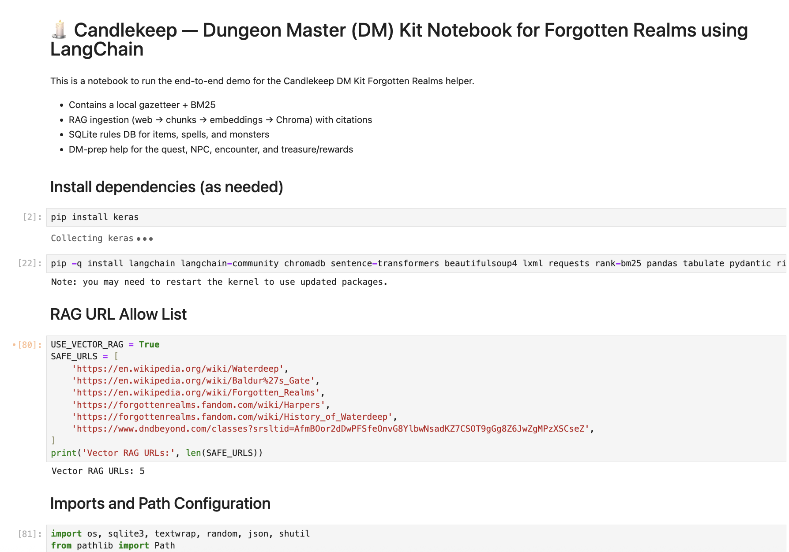
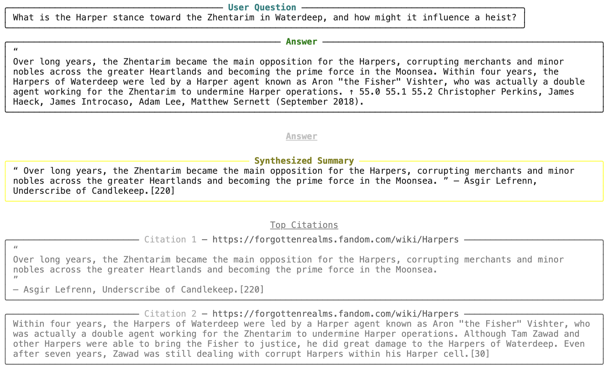

# 🕯️ Candlekeep DM Kit  
### A Retrieval-Augmented Dungeon Master Assistant for the Forgotten Realms  

> *“When the libraries of Candlekeep meet the capabilities of machine learning, Dungeon Masters gain a lorekeeper of their own.”*  

---

## Overview

**Candlekeep DM Kit** is an AI-driven tool that assists Dungeon Masters (DMs) in running adventures set in the **Forgotten Realms**.  
It combines **Retrieval-Augmented Generation (RAG)**, **structured world data**, and **context-aware generation** to surface canonical lore, faction dynamics, city details, and quick DM-prep resources like **quests**, **NPCs**, **encounters**, and **treasures** — all cited and contextualized for in-game use.

The project is implemented as a **single executable Jupyter Notebook** (`Candlekeep_DM_Kit_Demo_v3.ipynb`) and demonstrates a full **end-to-end LangChain pipeline** with automatic fallbacks, modular layers, and real web-based data retrieval.

---

## Problem Statement

Dungeon Masters often face the same challenge:  
navigating hundreds of pages of Forgotten Realms lore or unreliable wikis mid-session to answer player questions like:

> “What’s the Harper stance toward the Zhentarim in Waterdeep?”  
> “What factions operate around the Sword Coast?”  
> “What rumors might lead to a heist in Baldur’s Gate?”

Candlekeep DM Kit solves this by creating a **retrieval-augmented lore system** that semantically indexes public, open-licensed content (e.g., Wikipedia pages on Waterdeep, Harpers, Zhentarim) and a local lore gazetteer.  
Queries are answered using a hybrid of semantic search and structured generation, returning **concise summaries with explicit citations** and **DM-ready prep blocks**.

---

## Why LangChain / LlamaIndex Is an Ideal Framework

Candlekeep DM Kit is built around a retrieval-augmented generation (RAG) workflow that blends **structured retrieval** with **generative synthesis** to help Dungeon Masters instantly surface trustworthy Forgotten Realms lore.  
LangChain and LlamaIndex are ideal frameworks for this purpose because they provide modular, production-ready building blocks for every stage of that pipeline:

| RAG Stage | Framework Component | Benefit |
|------------|--------------------|----------|
| **Data Ingestion** | `WebBaseLoader`, `SimpleDirectoryReader` | Seamlessly load public web pages (e.g., Wikipedia lore) and local markdown gazetteers without manual scraping. |
| **Text Chunking** | `RecursiveCharacterTextSplitter` | Splits long lore pages into overlapping segments that preserve narrative coherence and improve recall. |
| **Embedding & Vector Storage** | `HuggingFaceEmbeddings + ChromaVectorStore` | Transforms text into dense vectors for semantic similarity search while remaining lightweight and open-source (no paid APIs). |
| **Retrieval Layer** | `.as_retriever()` / `.similarity_search()` / MMR | Offers multiple retriever modes—MMR for diversity, similarity for precision, BM25 as fallback—through one unified API. |
| **Composability & Fallbacks** | LangChain Runnable interface | Enables smooth switching between persistent, in-memory, and lexical retrieval depending on runtime constraints. |
| **Extensibility** | LlamaIndex abstractions (optional) | Allows the same index to be queried or expanded through a high-level graph interface if future multi-document reasoning is added. |

By using these frameworks, the project achieves:

- **Reproducibility:** Each stage (loader → splitter → embedder → retriever) is parameterized and testable.  
- **Transparency:** Every answer cites its **source URL** or local file for academic traceability.  
- **Portability:** Works online or fully offline without proprietary dependencies.  
- **Pedagogical value:** Clearly demonstrates the structure and mechanics of modern RAG systems.

---

## System Design

### Architecture Summary
1. **Ingestion:** `WebBaseLoader` fetches a curated set of open-licensed lore pages (Wikipedia, Forgotten Realms factions).  
2. **Chunking:** `RecursiveCharacterTextSplitter` breaks text into overlapping, coherent sections.  
3. **Embedding:** `HuggingFaceEmbeddings (all-MiniLM-L6-v2)` encodes chunks into semantic vectors.  
4. **Indexing:** Vectors are persisted in **ChromaDB** (or in-memory fallback if storage is read-only).  
5. **Retrieval:** Queries are run via **Max Marginal Relevance (MMR)** or **similarity search** to find relevant passages.  
6. **Answering:** Retrieved chunks are summarized and cited in rich Markdown panels for clarity.  
7. **DM Prep:** SQLite-based generators output setting-aligned **Quest**, **NPC**, **Encounter**, and **Treasure** stubs for session planning.

<p align="center">
  
</p>

### Example Notebook Output

<p align="center">
  
</p>

<p align="center"><i>Figure 1: End-to-end demo of the Candlekeep DM Kit running RAG-based lore retrieval and citation.</i></p>

---

### System Flowchart

```mermaid
flowchart TD
    A["Config & Toggles"]
    B["WebBaseLoader (allowlist)"]
    C["Local Gazetteer (.md)"]
    D["RecursiveCharacterTextSplitter"]
    E["HuggingFace Embeddings"]
    F{"Chroma Vector Store"}
    G["Retriever (MMR / Similarity)"]
    H["In-Memory Vector Store"]
    I["Answer Synthesis + Citations"]
    J["Styled Output Panels"]
    K["SQLite Rules DB"]
    L["DM Prep Blocks (Quest | NPC | Encounter | Treasure)"]

    A --> B
    A --> C
    B --> D
    C --> D
    D --> E
    E --> F
    F -- Success --> G
    F -- Fail --> H
    H --> G
    G --> I
    I --> J
    J --> K
    K --> L

